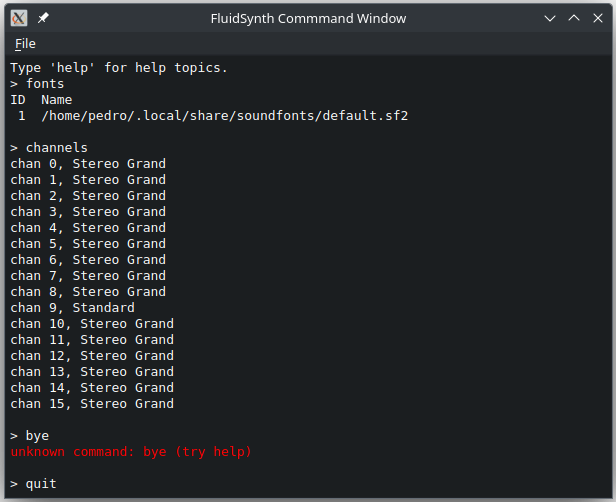
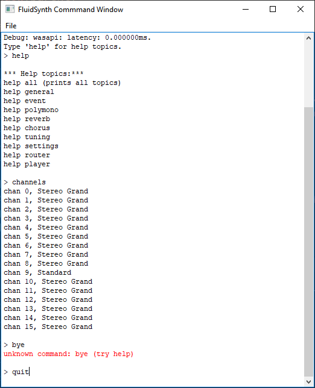

# fluidsynth-qt-gui
GUI interface for FluidSynth commands

This is a basic GUI command shell implementation using Qt6 widgets for the FluidSynth library. The console window is based on ConsoleWidget.

Another similar alternative is [netcat-qt](https://github.com/pedrolcl/netcat-qt).

  
  

## License
SPDX-License-Identifier: MIT  
Copyright (c) 2024 Pedro López-Cabanillas <plcl@users.sf.net>  
Copyright (c) 2020 George Apostolopoulos  

